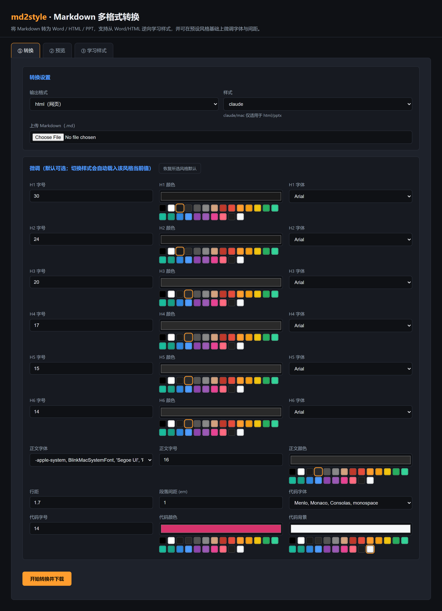
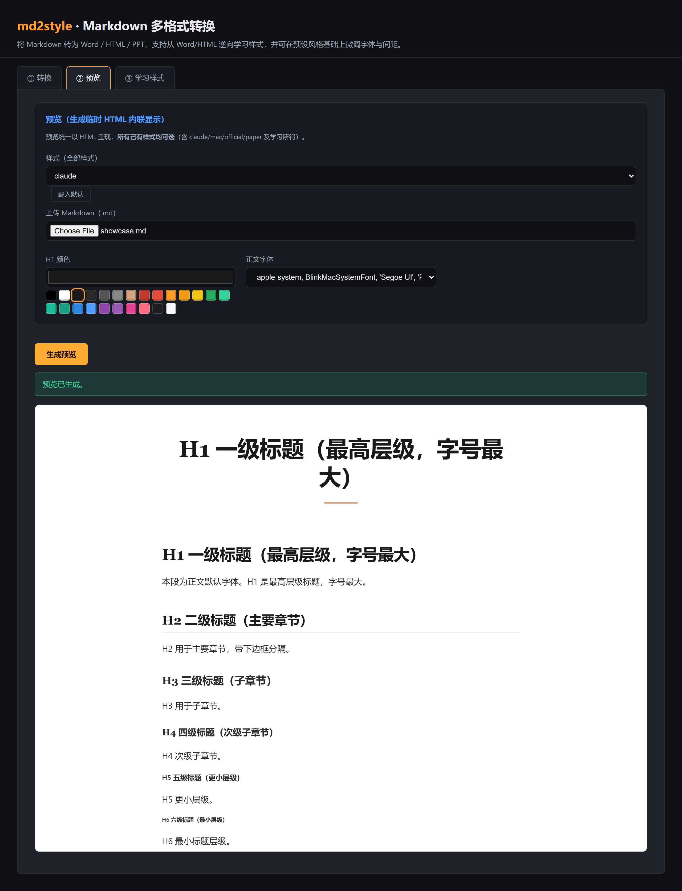
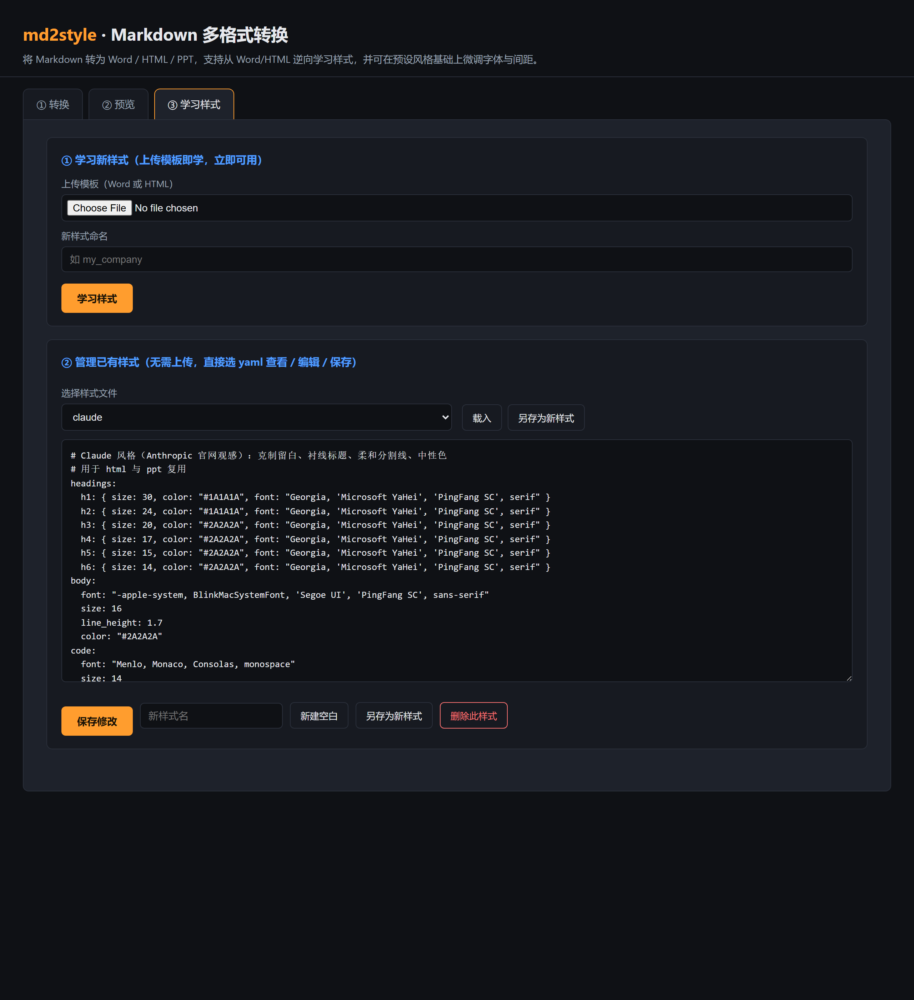

<p align="center">
  <h1 align="center">md2style</h1>
  <p align="center">Markdown 多格式转换工具 | Markdown-to-Document Converter</p>
  <p align="center">
    <a href="https://github.com/zh2673-git/md2style"></a>
    <a href="https://github.com/zh2673-git/md2style"></a>
    <a href="https://github.com/zh2673-git/md2style"></a>
  </p>
</p>

---

## 简介 | Introduction

**中文**：`md2style` 是一个本地优先的 Markdown 转换工具，可将 Markdown 一键转换为 **Word / HTML / PPT**，支持从 Word/HTML 模板**逆向学习样式**，并在预设风格基础上**微调字体、颜色与间距**。提供 **FastAPI + 原生 HTML/JS** 的 Web 界面，也提供命令行（CLI），适合普通用户与自动化/LLM 调用。

**English**: `md2style` is a local-first Markdown converter that turns Markdown into **Word / HTML / PPT**. It can **learn styles from Word/HTML templates** and lets you **fine-tune fonts, colors, and spacing** on top of built-in presets. It ships with a **FastAPI + vanilla HTML/JS** web UI as well as a CLI for automation and LLM workflows.

> 仓库地址 | Repository: https://github.com/zh2673-git/md2style.git

---

## 功能特性 | Features

| 中文 | English |
|---|---|
| 多格式输出：`.docx` / `.html` / `.pptx` | Multi-format output: `.docx` / `.html` / `.pptx` |
| 预设风格：HTML/PPT 的 `claude`（金橙暖调）、`mac`（苹果蓝）；Word 的 `official`（公文）、`paper`（论文） | Built-in presets: `claude` (warm gold/orange) / `mac` (Apple blue) for HTML/PPT; `official` / `paper` for Word |
| 从 Word/HTML **学习新样式**，生成 YAML 预设 | **Learn new styles** from Word/HTML templates and save as YAML presets |
| 在预设风格上微调：H1–H6 字号/颜色/字体、正文字体/字号/颜色/行距/段间距、代码块配色 | Fine-tune on presets: H1–H6 size/color/font, body font/size/color/line-height/spacing, code block colors |
| Web 界面三区 Tab（转换 / 预览 / 学习管理），互不阻塞 | Web UI with three tabs (Convert / Preview / Learn & Manage) that don't block each other |
| CLI 子命令参数经白名单校验，防止未知参数扩散 | CLI arguments validated against an allow-list to block hallucinated parameters |

---

## 界面截图 | Screenshots

> 以下截图来自真实运行的 Web 界面（`http://127.0.0.1:8080`）。
> Screenshots are captured from the running local web interface.

### ① 转换 Tab（颜色色板 + 字体下拉 + 数字微调）
| Convert Tab with color swatches, font dropdowns, and number inputs |
|---|---|
|  |

### ② 预览 Tab（实时生成 HTML 并内联显示）
| Preview Tab renders HTML inline in real time |
|---|---|
|  |

### ③ 学习样式 / 管理已有样式（载入/新建空白/另存/删除）
| Learn & Manage styles (load / create blank / save-as / delete) |
|---|---|
|  |

---

## 安装 | Installation

需要 Python 3.10+。/ Requires Python 3.10+.

```bash
cd md2style

# 方式一：Poetry（推荐） / Option 1: Poetry (recommended)
poetry install

# 方式二：pip / Option 2: pip
pip install python-docx python-pptx Jinja2 Pygments PyYAML markdown-it-py fastapi uvicorn playwright
```

---

## 快速开始 | Quick Start

### A. Web 界面（推荐） | Web UI (recommended)

```bash
python -m md2style.interfaces.web
```

浏览器打开 | Open in browser: http://127.0.0.1:8080

界面顶部有三个 Tab：/ The top has three tabs:

1. **转换 | Convert**：上传 `.md` → 选输出格式 → 选样式 → 微调字段默认显示当前风格取值 → 转换下载
   - 选 `docx` 时样式下拉仅显示 `official` / `paper`；`claude` / `mac` 仅用于 `html` / `pptx`
   - Choose `docx` to see `official` / `paper`; `claude` / `mac` are only available for `html` / `pptx`
2. **预览 | Preview**：上传 `.md` → 选样式 → 生成临时 HTML 并内联显示（无需下载）
   - Upload `.md`, pick a style, and preview rendered HTML inline
3. **学习样式 | Learn**：上传 Word/HTML 模板，命名后即可在样式下拉中使用
   - Upload a Word/HTML template, name it, and the new style appears in the style dropdown
4. **管理已有样式 | Manage**：载入任意 `.yaml` 查看/编辑/保存；新建空白样式；另存为新样式；删除样式（二次确认）
   - Load any `.yaml` to edit/save; create a blank style; save-as; delete (confirmation required)

一键启动脚本：/ One-click startup:

```bash
python start_web.py
```

API 文档：/ API docs: http://127.0.0.1:8080/docs

### B. 命令行 | CLI

```bash
# 转换为 Word（论文风格） / Convert to Word (paper style)
python -m md2style.cli convert -i examples/complex.md -o out.docx -s paper

# 转换为 HTML（claude 风格 + 微调） / Convert to HTML (claude style + tune)
python -m md2style.cli convert -i examples/complex.md -o out.html -s claude \
    --h1-size 40 --h2-color #C0392B --body-size 18 --para-spacing 1.4 \
    --code-bg #1E1E1E --code-color #D4D4D4

# 转换为 PPT（mac 风格） / Convert to PPT (mac style)
python -m md2style.cli convert -i examples/complex.md -o out.pptx -s mac

# 生成临时 HTML 预览 / Generate temporary HTML preview
python -m md2style.cli preview -i examples/complex.md -s claude

# 从模板学习样式 / Learn style from template
python -m md2style.cli learn -t my_template.docx -n my_company
```

---

## 微调参数一览 | Fine-tune Parameters (CLI)

在所选风格基础上覆盖，留空则使用默认。/ Override selected style values; omit to keep defaults.

| 参数 / Parameter | 说明 / Description |
|---|---|
| `--h1-size` … `--h6-size` | H1–H6 字号 / H1–H6 font size |
| `--h1-color` … `--h6-color` | H1–H6 颜色 / H1–H6 color |
| `--h1-font` … `--h6-font` | H1–H6 字体 / H1–H6 font |
| `--body-font` | 正文字体 / Body font |
| `--body-size` | 正文字号 / Body font size |
| `--body-color` | 正文颜色 / Body color |
| `--line-height` | 正文行距 / Body line height |
| `--para-spacing` | 段落间距（em）/ Paragraph spacing (em) |
| `--code-font` | 代码字体 / Code font |
| `--code-size` | 代码字号 / Code font size |
| `--code-color` | 代码颜色 / Code color |
| `--code-bg` | 代码背景 / Code background |
| `--template` | docx 模板（dotx）名 / docx template (dotx) name |

Web 界面中上述参数对应为：颜色字段为色板、字体字段为下拉、数字字段为数字框，切换样式自动回填当前风格默认值。/ In the web UI: colors are swatches, fonts are dropdowns, sizes are number inputs, and changing the style auto-fills the preset values.

---

## 样式优先级 | Style Priority

```
DEFAULT（硬编码兜底） < YAML（预设/学习所得） < CLI/Web 微调参数
DEFAULT (hard-coded fallback) < YAML (presets / learned) < CLI/Web fine-tune overrides
```

合并后经 `StyleEngine.validate` 校验（颜色格式、字号范围、字体存在性），非法参数直接报错，不会生成脏文件。/ After merging, `StyleEngine.validate` checks color format, size ranges, and font availability; invalid values raise errors instead of producing broken files.

---

## 项目结构 | Project Structure

```
md2style/
├── cli.py                  # CLI 入口 / CLI entry
├── orchestrator.py         # 子命令路由 + 参数白名单 + 编排 / Routing + allow-list + orchestration
├── core/                   # 常量、IR、错误类型 / Constants, IR, errors
├── engines/
│   ├── md_parser.py        # Markdown -> IR（markdown-it）
│   ├── style_engine.py     # 三层优先级合并 + 校验 / Three-level merge + validation
│   └── learner.py          # Word/HTML -> YAML 样式预设 / Word/HTML -> YAML preset
├── renderers/              # docx / html / pptx 渲染器 / Renderers
├── interfaces/
│   └── web/                # 本地 Web 界面（FastAPI + 原生 HTML/JS） / Local web UI
└── utils/                  # 颜色/字体/日志工具 / Color/font/log utilities
styles/                     # 预设样式 YAML / Preset YAML styles
examples/                   # 示例 md 与生成产物 / Sample markdown and outputs
tests/                      # 单元测试 / Unit tests
```

---

## 测试 | Tests

```bash
pytest
```

---

## 设计原则 | Design Principles

- **白名单机制 / Allow-list only**：CLI/Web 仅接受已知参数，未知参数一律拦截，杜绝 LLM 幻觉扩散。/ Only known parameters are accepted; unknown parameters are rejected to prevent LLM hallucinations from spreading downstream.
- **界面无业务规则 / UI holds no business rules**：Web/CLI 只做参数采集与展示，所有规则在 Orchestrator / Engines / Renderers 中统一处理。/ Web/CLI only collect and display parameters; all rules live in the orchestrator/engines/renderers.
- **可学习 / Learnable**：用户看到好模板即可“拖入即学”，沉淀为可复用的 YAML 预设。/ Users can drop in any nice template to learn its style and turn it into a reusable YAML preset.

---

## License

MIT © zh2673-git
